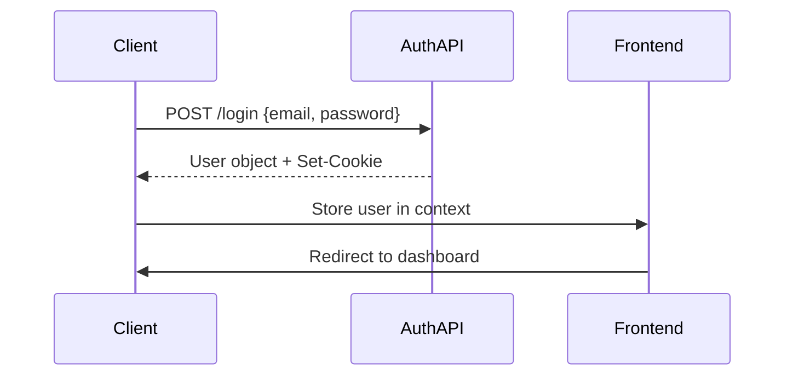

# Web API System Specification Document (SSD)
## IsolaKwaMUNTU Streaming Platform

---

## Document Information

| **Field** | **Value** |
|-----------|-----------|
| **Document Title** | Web API System Specification Document |
| **Project** | IsolaKwaMUNTU Streaming Platform (iso-media-next) |
| **Version** | 1.0 |
| **Date** | 2025-09-12 |
| **Author** | Development Team |
| **Status** | Draft |

---

## Table of Contents

1. [Document Purpose & Audience](#1-document-purpose--audience)
2. [System Overview](#2-system-overview)
3. [API Architecture](#3-api-architecture)
4. [Authentication & Authorization](#4-authentication--authorization)
5. [API Endpoints Specification](#5-api-endpoints-specification)
6. [Data Models & Structures](#6-data-models--structures)
7. [Error Handling](#7-error-handling)
8. [Security Considerations](#8-security-considerations)
9. [Integration Patterns](#9-integration-patterns)
10. [Recommendations](#10-recommendations)

---

## 1. Document Purpose & Audience

### 1.1 Purpose
This System Specification Document (SSD) provides comprehensive documentation for the Web API infrastructure supporting the IsolaKwaMUNTU streaming platform. It serves as the definitive reference for understanding API endpoints, data structures, authentication mechanisms, and integration patterns used throughout the application.

### 1.2 Audience
- **Frontend Developers**: Understanding API integration patterns and endpoint specifications
- **Backend Developers**: Reference for API implementation and maintenance
- **QA Engineers**: Test case development and API validation
- **DevOps Engineers**: Infrastructure planning and monitoring setup
- **Product Managers**: Feature planning and system capabilities understanding
- **Security Team**: Security assessment and vulnerability analysis

### 1.3 Scope
This document covers all external API integrations within the iso-media-next frontend application, including:
- User authentication and management
- Video interaction services
- Payment processing
- Content delivery mechanisms
- Mock/placeholder services

---

## 2. System Overview

### 2.1 System Architecture
The IsolaKwaMUNTU streaming platform follows a microservices architecture with separate API services handling different business domains:

```
┌─────────────────┐    ┌──────────────────┐    ┌─────────────────┐
│   Frontend      │    │   Auth/User API  │    │  Payment API    │
│   (Next.js)     │◄──►│   Port: 4002     │    │   Port: 4000    │
│                 │    │                  │    │                 │
└─────────────────┘    └──────────────────┘    └─────────────────┘
         │                       │                       │
         │              ┌──────────────────┐             │
         └──────────────►│   Content CDN    │◄────────────┘
                        │   (External)     │
                        └──────────────────┘
```

### 2.2 Core Components
- **Frontend Application**: Next.js-based React application
- **Authentication Service**: User login, registration, and session management
- **Video Service**: Video interactions (likes, dislikes, comments)
- **Payment Service**: Stripe integration for subscription management
- **Content Delivery**: External CDN for video and image assets

### 2.3 Technology Stack
- **Frontend**: Next.js 14+, React, TypeScript
- **HTTP Client**: Native fetch() API
- **Authentication**: Cookie-based sessions
- **Payment Processing**: Stripe API integration
- **State Management**: React Context API

---

## 3. API Architecture

### 3.1 Base URLs
| **Service** | **Base URL** | **Purpose** |
|-------------|--------------|-------------|
| Main API | `http://172.24.74.185:4002` | Authentication, User Management, Video Operations |
| Payment API | `http://172.24.74.185:4000` | Payment processing, Stripe integration |
| Content CDN | `https://commondatastorage.googleapis.com/gtv-videos-bucket/` | Video streaming |
| Image CDN | `https://images.unsplash.com/` | Placeholder images |

### 3.2 Communication Protocol
- **Protocol**: HTTP/HTTPS
- **Data Format**: JSON
- **Character Encoding**: UTF-8
- **Content Type**: `application/json`

### 3.3 Request/Response Patterns
All API calls follow consistent patterns:

**Request Structure:**
```javascript
{
  method: 'POST' | 'GET' | 'PUT' | 'DELETE',
  headers: {
    'Content-Type': 'application/json'
  },
  body: JSON.stringify(requestData), // For POST/PUT
  credentials: 'include' // For authenticated endpoints
}
```

**Response Structure:**
```javascript
// Success Response
{
  data: { /* Response data */ },
  status: 200
}

// Error Response
{
  error: "Error message",
  status: 400 | 401 | 500
}
```

---

## 4. Authentication & Authorization

### 4.1 Authentication Method
The system uses cookie-based authentication with session management:

- **Session Storage**: Browser cookies
- **Cookie Names**: `auth_token`, `auth_user`
- **Expiration**: 7 days
- **Security**: HTTPOnly cookies (recommended)

### 4.2 Authentication Flow


### 4.3 Token Management
```typescript
// Authentication Context Implementation
interface AuthContext {
  user: User | null;
  login: (token: string, user: User) => void;
  logout: () => void;
  updateUser: (updates: Partial<User>) => void;
}

// Cookie Management
setCookie('auth_token', token, { 
  maxAge: 7 * 24 * 60 * 60, // 7 days
  httpOnly: true,
  secure: true // HTTPS only
});
```

---

## 5. API Endpoints Specification

### 5.1 Authentication Endpoints

#### 5.1.1 User Login
- **Endpoint**: `POST /login`
- **Base URL**: `http://172.24.74.185:4002`
- **Purpose**: Authenticate user credentials and establish session
- **Authentication**: None required

**Request:**
```typescript
interface LoginRequest {
  email: string;      // User email address
  password: string;   // User password (min 6 characters)
}
```

**Response:**
```typescript
interface LoginResponse {
  id: number;
  name: string;
  email: string;
  plan_id?: number;
  status?: string;
  // Additional user properties
}
```

**Usage Example:**
```typescript
const response = await fetch('http://172.24.74.185:4002/login', {
  method: 'POST',
  headers: { 'Content-Type': 'application/json' },
  body: JSON.stringify({ email, password })
});
const user = await response.json();
```

**Error Responses:**
- `400 Bad Request`: Invalid input data
- `401 Unauthorized`: Invalid credentials
- `500 Internal Server Error`: Server error

---

#### 5.1.2 User Registration
- **Endpoint**: `POST /profile`
- **Base URL**: `http://172.24.74.185:4002`
- **Purpose**: Create new user account
- **Authentication**: None required

**Request:**
```typescript
interface RegistrationRequest {
  id: null;                      // Always null for new users
  name: string;                  // User full name
  email: string;                 // Valid email address
  plan_id: number;              // Subscription plan (default: 1)
  status: "pending";            // Account status
  stripe_customer_id: null;     // Stripe customer (created later)
  currency: "USD";              // Account currency
  phone: null;                  // Phone number (optional)
  payment_method_id: null;      // Payment method (added later)
}
```

**Response:**
```typescript
interface RegistrationResponse {
  id: number;
  name: string;
  email: string;
  plan_id: number;
  status: string;
  created_at: string;
  updated_at: string;
}
```

**Usage Example:**
```typescript
const response = await fetch('http://172.24.74.185:4002/profile', {
  method: 'POST',
  headers: { 'Content-Type': 'application/json' },
  body: JSON.stringify(registrationData),
  credentials: 'include'
});
```

**Error Responses:**
- `400 Bad Request`: Validation errors
- `409 Conflict`: Email already exists
- `500 Internal Server Error`: Server error

---

### 5.2 Video Interaction Endpoints

#### 5.2.1 Like Video
- **Endpoint**: `POST /videos/{videoId}/like`
- **Base URL**: `http://172.24.74.185:4002`
- **Purpose**: Like or unlike a video
- **Authentication**: Required (user session)

**Path Parameters:**
```typescript
interface LikeVideoPath {
  videoId: number;    // Video ID to like/unlike
}
```

**Request:**
```typescript
interface LikeVideoRequest {
  userId: number;     // ID of the user performing action
  like: boolean;      // true to like, false to unlike
}
```

**Response:**
```typescript
interface LikeVideoResponse {
  likes: number;      // Updated total likes count
  dislikes: number;   // Updated total dislikes count
  userLiked: boolean; // Current user's like status
}
```

**Usage Example:**
```typescript
const response = await fetch(`http://172.24.74.185:4002/videos/${videoId}/like`, {
  method: 'POST',
  headers: { 'Content-Type': 'application/json' },
  body: JSON.stringify({ userId, like }),
  credentials: 'include'
});
```

**Error Responses:**
- `401 Unauthorized`: User not authenticated
- `404 Not Found`: Video not found
- `500 Internal Server Error`: Server error

---

#### 5.2.2 Dislike Video
- **Endpoint**: `POST /videos/{videoId}/dislike`
- **Base URL**: `http://172.24.74.185:4002`
- **Purpose**: Dislike or remove dislike from a video
- **Authentication**: Required (user session)

**Path Parameters:**
```typescript
interface DislikeVideoPath {
  videoId: number;    // Video ID to dislike/remove dislike
}
```

**Request:**
```typescript
interface DislikeVideoRequest {
  userId: number;     // ID of the user performing action
  dislike: boolean;   // true to dislike, false to remove dislike
}
```

**Response:**
```typescript
interface DislikeVideoResponse {
  likes: number;      // Updated total likes count
  dislikes: number;   // Updated total dislikes count
  userDisliked: boolean; // Current user's dislike status
}
```

**Usage Example:**
```typescript
const response = await fetch(`http://172.24.74.185:4002/videos/${videoId}/dislike`, {
  method: 'POST',
  headers: { 'Content-Type': 'application/json' },
  body: JSON.stringify({ userId, dislike }),
  credentials: 'include'
});
```

**Error Responses:**
- `401 Unauthorized`: User not authenticated
- `404 Not Found`: Video not found
- `500 Internal Server Error`: Server error

---

### 5.3 Payment Processing Endpoints

#### 5.3.1 Create Stripe Customer
- **Endpoint**: `POST /customer`
- **Base URL**: `http://172.24.74.185:4000`
- **Purpose**: Create Stripe customer for payment processing
- **Authentication**: Required (user session)

**Request:**
```typescript
interface CreateCustomerRequest {
  name: string;              // Customer full name
  email: string;             // Customer email address
  payment_method_id: string; // Stripe payment method ID
  profile_id: number;        // User profile ID
}
```

**Response:**
```typescript
interface CreateCustomerResponse {
  id: string;          // Stripe customer ID
  name: string;        // Customer name
  email: string;       // Customer email
  profile_id: number;  // Associated profile ID
  created_at: string;  // Creation timestamp
}
```

**Usage Example:**
```typescript
const response = await fetch('http://172.24.74.185:4000/customer', {
  method: 'POST',
  headers: { 'Content-Type': 'application/json' },
  body: JSON.stringify(customerData),
  credentials: 'include'
});
```

**Error Responses:**
- `400 Bad Request`: Invalid payment method or data
- `401 Unauthorized`: User not authenticated
- `402 Payment Required`: Payment method declined
- `500 Internal Server Error`: Stripe or server error

---

#### 5.3.2 Process Subscription Payment
- **Endpoint**: `POST /subscription`
- **Base URL**: `http://172.24.74.185:4000`
- **Purpose**: Create and process subscription payment
- **Authentication**: Required (user session)

**Request:**
```typescript
interface CreateSubscriptionRequest {
  customer_id: string;  // Stripe customer ID from previous call
  plan_id: string;      // Stripe price ID (e.g., "price_1QWXBTADdfkz5weOBz0VcbeW")
}
```

**Response:**
```typescript
interface CreateSubscriptionResponse {
  id: string;                    // Subscription ID
  customer_id: string;           // Stripe customer ID
  plan_id: string;              // Plan ID
  status: string;               // Subscription status
  current_period_start: string; // Period start date
  current_period_end: string;   // Period end date
  created_at: string;           // Creation timestamp
}
```

**Usage Example:**
```typescript
const response = await fetch('http://172.24.74.185:4000/subscription', {
  method: 'POST',
  headers: { 'Content-Type': 'application/json' },
  body: JSON.stringify({ customer_id, plan_id }),
  credentials: 'include'
});
```

**Error Responses:**
- `400 Bad Request`: Invalid customer or plan ID
- `401 Unauthorized`: User not authenticated
- `402 Payment Required`: Payment failed
- `409 Conflict`: Subscription already exists
- `500 Internal Server Error`: Stripe or server error

---

### 5.4 Mock/Placeholder Endpoints

#### 5.4.1 Password Reset (Mock)
- **Endpoint**: Not implemented (client-side mock)
- **Purpose**: Password reset functionality
- **Status**: Placeholder implementation

**Current Implementation:**
```typescript
// Mock implementation with setTimeout
const handleSubmit = async (e: React.FormEvent) => {
  e.preventDefault();
  setIsLoading(true);
  
  // Simulate API call delay
  setTimeout(() => {
    setIsLoading(false);
    setIsSubmitted(true);
  }, 2000);
};
```

**Future API Specification:**
```typescript
// Proposed implementation
interface PasswordResetRequest {
  email: string;
}

interface PasswordResetResponse {
  success: boolean;
  message: string;
}
```

---

#### 5.4.2 Contact Form Submission (Mock)
- **Endpoint**: Not implemented (client-side mock)
- **Purpose**: Contact form submission
- **Status**: Placeholder implementation

**Current Implementation:**
```typescript
// Mock implementation
const handleSubmit = async (e: React.FormEvent) => {
  e.preventDefault();
  
  // Validate form
  const validationErrors = validateForm();
  if (Object.keys(validationErrors).length > 0) {
    setErrors(validationErrors);
    return;
  }
  
  // Simulate submission
  setTimeout(() => {
    setFormState('success');
    resetForm();
  }, 1500);
};
```

**Future API Specification:**
```typescript
// Proposed implementation
interface ContactFormRequest {
  name: string;
  email: string;
  subject: string;
  message: string;
}

interface ContactFormResponse {
  success: boolean;
  message: string;
  ticket_id?: string;
}
```

---

## 6. Data Models & Structures

### 6.1 Core Domain Models

#### 6.1.1 User Model
```typescript
interface User {
  id: number;
  name: string;
  email: string;
  phone?: string;
  plan_id?: number;
  status: 'active' | 'pending' | 'suspended';
  stripe_customer_id?: string;
  payment_method_id?: string;
  currency: string;
  created_at: Date;
  updated_at: Date;
}
```

#### 6.1.2 Video Model
```typescript
interface Video {
  id: number;
  title: string;
  description: string;
  image_path: string;
  video_path: string;
  release_date: Date;
  rating: number;
  likes: number;
  dislikes: number;
  type: VideoType;
  user?: UserVideoInteraction;
}

interface VideoType {
  id: number;
  name: string;
  category: {
    id: number;
    name: string;
  };
}

interface UserVideoInteraction {
  id: number;
  like: boolean;
  dislike: boolean;
  rating: number;
}
```

#### 6.1.3 Episode Model
```typescript
interface Episode {
  id: number;
  video_id: number;
  series_id: number;
  season_id: number;
  episode_number: number;
  episode_detail: string;
  episode_short_detail: string;
  next_episode_id?: number;
  title: string;
  description: string;
  image_path: string;
  video_path: string;
  likes: number;
  dislikes: number;
  ratings: number;
  release_date: Date;
  user?: UserVideoInteraction;
}
```

#### 6.1.4 Comment System Models
```typescript
interface VideoComment {
  iso_comment: IsoComment;
  post_date: Date;
  customer: CommentAuthor;
  reply: Reply[] | null;
}

interface IsoComment {
  id: number;
  comment: string;
  customer_id: number;
}

interface CommentAuthor {
  id: number;
  name: string;
  avatar?: string;
}

interface Reply {
  id: number;
  comment: string;
  customer_id: number;
  parent_comment_id: number;
  post_date: Date;
  customer: CommentAuthor;
}
```

#### 6.1.5 Payment Models
```typescript
interface StripeCustomer {
  id: string;              // Stripe customer ID
  name: string;
  email: string;
  profile_id: number;
  created_at: Date;
}

interface Subscription {
  id: string;              // Stripe subscription ID
  customer_id: string;     // Stripe customer ID
  plan_id: string;         // Stripe price ID
  status: 'active' | 'canceled' | 'past_due' | 'incomplete';
  current_period_start: Date;
  current_period_end: Date;
  cancel_at?: Date;
  created_at: Date;
}
```

### 6.2 Form Data Models

#### 6.2.1 Authentication Forms
```typescript
interface LoginFormData {
  email: string;
  password: string;
}

interface RegistrationFormData {
  first_name: string;
  email: string;
  password: string;
  terms_accepted: boolean;
  marketing_consent?: boolean;
}

interface ForgotPasswordFormData {
  email: string;
}
```

#### 6.2.2 Contact Form Models
```typescript
interface ContactFormData {
  name: string;
  email: string;
  subject: 'general' | 'technical' | 'billing' | 'content';
  message: string;
}

interface ContactFormErrors {
  name?: string;
  email?: string;
  subject?: string;
  message?: string;
}
```

### 6.3 API Response Wrappers

#### 6.3.1 Standard API Response
```typescript
interface APIResponse<T> {
  data: T;
  status: number;
  message?: string;
}

interface APIError {
  error: string;
  status: number;
  details?: Record<string, any>;
}
```

#### 6.3.2 Paginated Response
```typescript
interface PaginatedResponse<T> {
  data: T[];
  total: number;
  page: number;
  per_page: number;
  total_pages: number;
}
```

---

## 7. Error Handling

### 7.1 Error Response Structure
All API endpoints return consistent error responses:

```typescript
interface APIError {
  error: string;           // Human-readable error message
  status: number;          // HTTP status code
  code?: string;           // Application-specific error code
  details?: {              // Additional error details
    field?: string;        // Field that caused validation error
    value?: any;          // Invalid value provided
  };
  timestamp: string;       // Error timestamp
}
```

### 7.2 HTTP Status Codes
| **Status Code** | **Meaning** | **Usage** |
|-----------------|-------------|-----------|
| 200 | OK | Successful request |
| 201 | Created | Resource successfully created |
| 400 | Bad Request | Invalid request data or validation error |
| 401 | Unauthorized | Authentication required or failed |
| 403 | Forbidden | Insufficient permissions |
| 404 | Not Found | Resource not found |
| 409 | Conflict | Resource conflict (e.g., duplicate email) |
| 422 | Unprocessable Entity | Validation errors |
| 429 | Too Many Requests | Rate limit exceeded |
| 500 | Internal Server Error | Server-side error |
| 502 | Bad Gateway | Upstream service error |
| 503 | Service Unavailable | Service temporarily unavailable |

### 7.3 Client-Side Error Handling Pattern
```typescript
const handleAPICall = async (endpoint: string, options: RequestInit) => {
  try {
    const response = await fetch(endpoint, options);
    
    if (!response.ok) {
      const errorData = await response.json();
      throw new APIError(errorData.error, response.status, errorData);
    }
    
    return await response.json();
  } catch (error) {
    if (error instanceof APIError) {
      // Handle known API errors
      setErrorState(error.message);
    } else {
      // Handle network or unexpected errors
      setErrorState('An unexpected error occurred. Please try again.');
    }
    throw error;
  }
};
```

### 7.4 Error Recovery Strategies
- **Retry Logic**: Automatic retry for 5xx errors with exponential backoff
- **Fallback Data**: Use cached or default data when APIs are unavailable
- **User Feedback**: Clear error messages with actionable steps
- **Logging**: Error tracking for debugging and monitoring

---

## 8. Security Considerations

### 8.1 Current Security Implementation

#### 8.1.1 Authentication Security
- **Method**: Cookie-based sessions
- **Storage**: Browser cookies with 7-day expiration
- **Transmission**: Credentials sent with requests via `credentials: 'include'`
- **Weakness**: Hardcoded mock tokens in development

#### 8.1.2 Data Transmission Security
- **Current**: HTTP endpoints (development)
- **Required**: HTTPS for production
- **Headers**: Standard Content-Type headers
- **CORS**: Handled via credentials include

### 8.2 Security Vulnerabilities

#### 8.2.1 Critical Issues
1. **HTTP Protocol**: All API calls use HTTP instead of HTTPS
2. **Hardcoded Tokens**: Authentication uses static mock tokens
3. **No CSRF Protection**: Missing CSRF token validation
4. **Client-Side Validation**: No server-side input validation verification

#### 8.2.2 Medium Risk Issues
1. **No Rate Limiting**: APIs lack rate limiting protection
2. **Cookie Security**: Cookies not marked as HttpOnly/Secure
3. **Error Disclosure**: Detailed error messages may reveal system information
4. **No Request Signing**: API requests lack integrity verification

### 8.3 Security Recommendations

#### 8.3.1 Immediate Actions
```typescript
// 1. HTTPS Configuration
const API_BASE_URL = process.env.NODE_ENV === 'production' 
  ? 'https://api.isolakwamuntu.com' 
  : 'http://localhost:4002';

// 2. Secure Cookie Configuration
setCookie('auth_token', token, {
  maxAge: 7 * 24 * 60 * 60,
  httpOnly: true,
  secure: process.env.NODE_ENV === 'production',
  sameSite: 'strict'
});

// 3. JWT Implementation
interface JWTPayload {
  user_id: number;
  email: string;
  exp: number;
  iat: number;
}
```

#### 8.3.2 Long-term Security Enhancements
1. **API Gateway**: Implement centralized security controls
2. **OAuth 2.0**: Replace cookie auth with OAuth/JWT
3. **Input Sanitization**: Server-side validation and sanitization
4. **Audit Logging**: Comprehensive API access logging
5. **Penetration Testing**: Regular security assessments

---

## 9. Integration Patterns

### 9.1 Frontend Integration Architecture

#### 9.1.1 API Client Pattern
```typescript
// Current: Direct fetch calls
const response = await fetch(endpoint, options);

// Recommended: Centralized API client
class APIClient {
  private baseURL: string;
  private defaultHeaders: Record<string, string>;
  
  constructor(baseURL: string) {
    this.baseURL = baseURL;
    this.defaultHeaders = {
      'Content-Type': 'application/json'
    };
  }
  
  async request<T>(endpoint: string, options?: RequestInit): Promise<T> {
    // Centralized error handling, retry logic, etc.
  }
}
```

#### 9.1.2 State Management Pattern
```typescript
// Current: Local component state + Context API
interface AuthContext {
  user: User | null;
  login: (token: string, user: User) => void;
  logout: () => void;
  updateUser: (updates: Partial<User>) => void;
}

// Recommended: Enhanced state management
interface AppState {
  auth: AuthState;
  videos: VideoState;
  ui: UIState;
  api: APIState;
}
```

### 9.2 Error Handling Integration

#### 9.2.1 Global Error Boundary
```typescript
interface ErrorBoundaryState {
  hasError: boolean;
  error?: Error;
  errorInfo?: ErrorInfo;
}

class APIErrorBoundary extends Component<Props, ErrorBoundaryState> {
  static getDerivedStateFromError(error: Error): ErrorBoundaryState {
    return { hasError: true, error };
  }
  
  componentDidCatch(error: Error, errorInfo: ErrorInfo) {
    // Log error to monitoring service
    console.error('API Error:', error, errorInfo);
  }
}
```

### 9.3 Caching Strategy

#### 9.3.1 Current Implementation
- **None**: No caching implemented
- **State**: Component-level state management

#### 9.3.2 Recommended Caching Strategy
```typescript
interface CacheStrategy {
  key: string;
  ttl: number; // Time to live in seconds
  strategy: 'memory' | 'localStorage' | 'sessionStorage';
}

const API_CACHE_CONFIG: Record<string, CacheStrategy> = {
  user_profile: { key: 'user', ttl: 3600, strategy: 'localStorage' },
  video_metadata: { key: 'videos', ttl: 1800, strategy: 'memory' },
  payment_methods: { key: 'payment', ttl: 7200, strategy: 'sessionStorage' }
};
```

### 9.4 Real-time Integration

#### 9.4.1 Current Limitations
- **Polling**: No real-time updates implemented
- **WebSockets**: Not utilized
- **Server-Sent Events**: Not implemented

#### 9.4.2 Future Real-time Features
```typescript
// WebSocket integration for real-time features
interface WebSocketEvents {
  'comment.new': (comment: VideoComment) => void;
  'video.liked': (videoId: number, likes: number) => void;
  'user.status': (userId: number, status: string) => void;
}

class RealtimeClient {
  private ws: WebSocket;
  
  connect(userId: number) {
    this.ws = new WebSocket(`wss://api.isolakwamuntu.com/ws/${userId}`);
  }
  
  subscribe<K extends keyof WebSocketEvents>(
    event: K, 
    handler: WebSocketEvents[K]
  ) {
    // Event subscription logic
  }
}
```

---

## 10. Recommendations

### 10.1 Immediate Improvements (High Priority)

#### 10.1.1 Security Enhancements
1. **HTTPS Migration**: Convert all API endpoints to HTTPS
2. **JWT Implementation**: Replace hardcoded tokens with proper JWT
3. **Input Validation**: Add server-side validation
4. **CSRF Protection**: Implement CSRF token validation

#### 10.1.2 Code Organization
1. **API Client**: Create centralized API client utility
2. **Error Handling**: Implement global error boundary
3. **Type Safety**: Add comprehensive TypeScript interfaces
4. **Environment Config**: Externalize API URLs and configuration

### 10.2 Medium-term Improvements (Medium Priority)

#### 10.2.1 Performance Optimization
1. **Caching Strategy**: Implement intelligent caching
2. **Request Deduplication**: Prevent duplicate API calls
3. **Pagination**: Add pagination for large data sets
4. **Lazy Loading**: Implement progressive data loading

#### 10.2.2 User Experience
1. **Offline Support**: Add offline functionality with service workers
2. **Real-time Updates**: Implement WebSocket integration
3. **Loading States**: Enhanced loading and skeleton screens
4. **Error Recovery**: User-friendly error recovery mechanisms

### 10.3 Long-term Enhancements (Low Priority)

#### 10.3.1 Advanced Features
1. **GraphQL Migration**: Consider GraphQL for complex queries
2. **Microservices**: Further service decomposition
3. **CDN Integration**: Advanced content delivery optimization
4. **Analytics**: API usage analytics and monitoring

#### 10.3.2 Scalability
1. **Rate Limiting**: Implement intelligent rate limiting
2. **Circuit Breaker**: Add circuit breaker pattern
3. **Load Balancing**: API load balancing strategy
4. **Monitoring**: Comprehensive API monitoring and alerting

---

## Conclusion

This System Specification Document provides comprehensive documentation of the current Web API infrastructure for the IsolaKwaMUNTU streaming platform. While the current implementation successfully supports basic functionality, there are significant opportunities for improvement in security, error handling, performance, and user experience.

The recommendations outlined in this document should be prioritized based on business requirements and technical constraints. Immediate focus should be placed on security enhancements and code organization improvements, followed by performance optimizations and advanced features.

Regular updates to this document are recommended as the API evolves and new features are implemented. This ensures that all stakeholders maintain accurate understanding of the system architecture and integration patterns.

---

**Document Version History:**

| Version | Date | Changes | Author |
|---------|------|---------|---------|
| 1.0 | 2025-09-12 | Initial document creation | Development Team |

**Review Schedule:**
- **Next Review**: 2025-10-12
- **Review Frequency**: Monthly
- **Update Triggers**: API changes, new endpoints, security updates